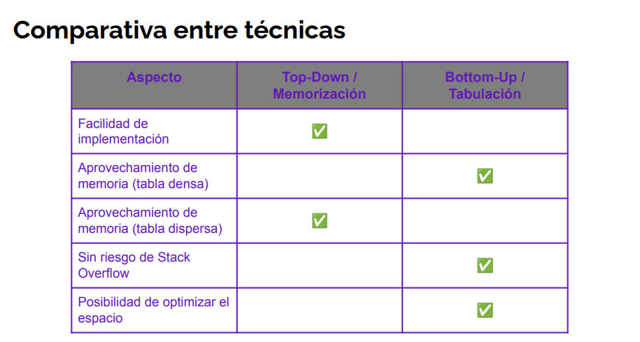

# Dynamic programming

## Definition

Dynamic programming is an optimization technique that involves breaking a problem into smaller subproblems, solving the subproblems, and storing the solutions in order to solve the original problem more efficiently.

    It uses the resolution of overlapping subproblems and memoization to solve complex problem in an efficient way.

The original problem gets divided into smaller subproblems and it resolves incrementally, using stored information to avoid recalculating already calculated results.

    The global optimal solution is found combining the optimal solutions of the subproblems.

## Conditions

### Optimal substructure

A problem has optimal substructure if the optimal solution of the problem can be constructed from the optimal solutions of its subproblems. This respects the **principle of optimality.**

### Overlapping subproblems

A problem has overlapping subproblems if the problem can be broken down into smaller subproblems that are reused several times.

    This is the key to dynamic programming. It allows us to store the results of subproblems and reuse them when needed.

## Pros and cons

### Pros

- Used for complex problems of **optimization**.
- Allows **efficient** resolution of problems.
- Divides problem into smaller ones **avoiding recalculations**.
- Can be aplied to multiple kinds of problems.

### Cons

- It can need a lot of **memory** to store the results of subproblems.
- **Complex** to implement and understand.
- **Maybe the solution is not the most efficient**, specially if there are already specific solutions for certain problems.

## Types

### Top-down

A recursive way is used but we also add **memoization** to store results, so we don't need to recalculate them. Similar concept of **_caching_** because we store results following the principle of **temporal locality**.

    We usually use a dictionary.

1. Add a variable, dictionary or some memory structure to store the results.
2. Decide the key for subproblems.
3. Base case where we check if it's already solved.
4. If not, we solve the subproblem recursively and **store the result before returning**.

### Bottom-up

We start from the smallest subproblems and solve them incrementally, storing the results in order to solve the bigger problems.

    We usually use a table, with many dimensions as params in the problem.

## Examples

### Fibonacci numbers

One classic example of dynamic programming is calculating the Fibonacci numbers. The Fibonacci sequence is defined as follows:

    We can take advantage of previous results by storing them in order to accelerate the final calculation.

### House's thief problem

