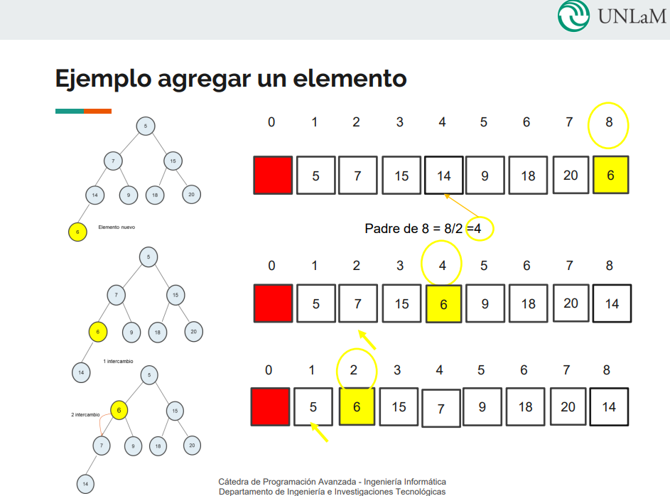

### Priority Queue

### Definition

A priority queue is a data structure that stores elements in a way that allows retrieval of the element with the highest priority.

The priority queue is similar to a queue, but the element that is removed from the queue is not necessarily the first element that was added. Instead, the element with the highest priority is removed first.

## Ways

### Lists

One way to implement a priority queue would be using a list. And it can be done in two ways:

1. **Unsorted List**: You insert elements in ANY order O(1) and then remove the element with the highest priority, by searching it O(n).

2. **Sorted List**: You insert elements in a sorted order O(n) and then remove the element with the highest priority, by removing the last element O(1).

### Heaps

A more efficient way would be to use the data structure known as Heap. A heap is a complete (or almost complete, with the last level filled from left to right) **binary tree** that satisfies the _Heap Property_:

    Every parent node has a priority that is greater (or less) than or equal to the priority of its children. Depends which way you want to implement it, MIN or MAX.

**Important note**: A complete (or almost complete) binary tree can be represented as an array.

    The root is at index 0, and for any node at index `i`, the left child is at index `2i` and the right child is at index `2i + 1`.

    If a child is at position `i`, then its parent is at position `FLOOR(i/2)`. Floor: parte entera.

## Time complexity

    For the heap, the time complexity of the insert and remove operations is O(log n).

## Operations

### Insert

1. Add the element to the **end** of the array.

2. **WHILE** parent exists **AND** parent bigger than elem: Swap the element with its parent.

### Remove

1. Remove the root element. (return it or don't)

2. Move the last element to the root.

3. **WHILE** left child exists: Compare the element with its children. If the element is smaller than the children, swap it with the smallest child. **BREAK** if the element is bigger than both children.
